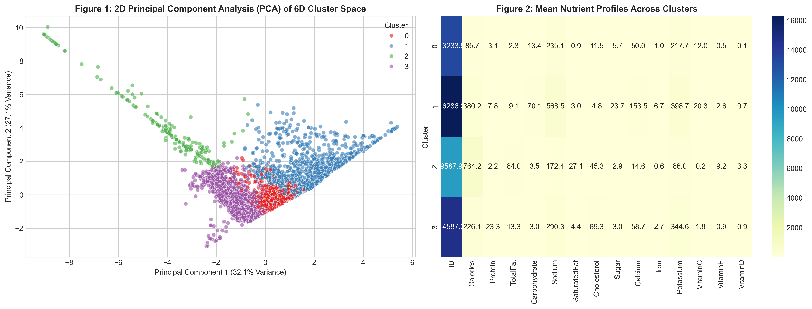

# USDA Food Phenotypes: K-Means Nutritional Clustering
**By Analyzing Objective Nutrient Geometry to Uncover Commercial Marketing Bias**

---

## 1. Project Overview & Goal
The main goal of this project was to evaluate how food can be accurately labeled based on objective classifications by macro and micronutrients. Food corporations often label foods in ways that disguise their true composition and metabolic effect, using misleading marketing that convinces consumers they are eating something different than they truly are. 

Testing how a computer groups food leaves out any marketing confusion and looks purely at the composition of the foods to group them together.

---

## 2. Dataset & Methods
I sourced 7,058 USDA foods and focused on six key macro and micronutrients: 
* **Calories**
* **Total Fat**
* **Saturated Fat**
* **Carbohydrates**
* **Sugar**
* **Sodium**

### Data Normalization & Machine Learning
* **StandardScaler:** I used a Z-score StandardScaler to normalize the data, ensuring that large numbers (like sodium in milligrams) didn't overpower smaller numbers (like protein in grams).
* **Elbow Method:** I optimized the dataset using the Elbow Method to find the best number of clusters ($K$).
* **K-Means Algorithm:** I trained a K-Means clustering algorithm with $K = 4$.

---

## 3. Findings & Observations

The computer grouped the dataset into 4 main profiles based purely on nutrient chemistry:
1. **Low Protein / Low Fat / Low Carbohydrate:** Mainly raw vegetables and simple foods.
2. **High Carbohydrate & High Sodium:** Common processed foods and sweets.
3. **High Fat:** Pure oils, shortenings, and dense fat sources.
4. **High Protein:** Lean/fatty meats, poultry, eggs, and dense protein sources.

### Key Discoveries:
* **Protein Sources Group Together Regardless of Origin:** Higher protein food sources often clustered together no matter what they were made of. For example, dried walrus meat and plant-based vegetarian sausage rolls shared the exact same protein-dense cluster because of their chemical composition.
* **Unmasking "Diet" Marketing:** Higher sodium and higher carbohydrate foods grouped together as processed foods. The computer clustered "diet" or "lower-fat" alternatives (like reduced-fat biscuits and Slim-A-Bear ice cream novelties) in the exact same group as standard cookies and caramel popcorn, showing that low-fat marketing doesn't change high carbohydrate/sugar reality.
* **Real Meats vs. Variants:** The computer separates real meats that are naturally high in protein from low-protein meat variants that fail to be high in protein, revealing the distinguishing characteristics between the two.

---

## 4. Conclusion
This study proves that machine learning and data analysis can objectively classify foods in a way that shows the true health profiles of all foods to the public, bypassing corporate marketing claims.
