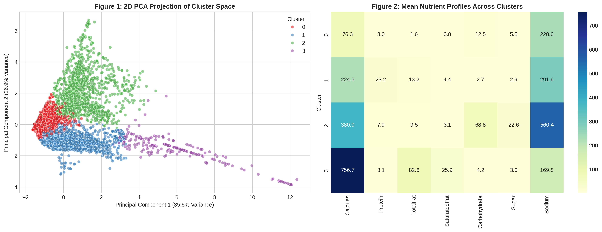

# Unsupervised Nutritional Profiling of USDA Foods Using K-Means Clustering
**Evaluating Nutrient-Based Food Classification Independent of Commercial Marketing Labels**

---

## Abstract
This project applies unsupervised machine learning to 7,058 USDA food items to identify nutrient-based groupings independent of commercial labeling. Using standardized nutritional features, Principal Component Analysis (PCA), and K-Means clustering, the analysis explores how foods naturally organize according to their underlying nutrient profiles.

---

## 1. Project Overview & Objective
Nutritional marketing often emphasizes specific claims (e.g., "low fat" or "diet") that may obscure a product's overall nutritional profile. The objective of this study is to evaluate whether an unsupervised machine learning model can objectively categorize food products based strictly on their quantitative nutrient composition, independent of commercial marketing labels.

---

## 2. Dataset & Methodology
This study analyzed **7,058 food items** from the USDA National Nutrient Database across seven core quantitative nutritional features (per 100g serving):
* **Calories (kcal)**
* **Protein (g)**
* **Total Fat (g)**
* **Saturated Fat (g)**
* **Carbohydrates (g)**
* **Sugar (g)**
* **Sodium (mg)**

### Machine Learning Pipeline
* **Data Normalization:** Features were standardized using a Z-score `StandardScaler` to prevent high-magnitude features (e.g., sodium in mg) from disproportionately influencing Euclidean distance calculations.
* **Dimensionality Reduction:** Principal Component Analysis (PCA) was applied to project the 7-dimensional feature space onto two principal axes (PC1 and PC2), retaining **59.12%** of overall feature variance.
* **Clustering & Hyperparameter Optimization:** K-Means clustering was executed for K values from 1 through 10. Hyperparameter selection (K = 4) was guided by Within-Cluster Sum of Squares (WCSS) inflection and validated via Silhouette Analysis, yielding an overall **Silhouette Score of 0.4014** (indicating moderate cluster separation).

---

## 3. Results & Visualizations

### Cluster Profile Summary (Mean Values per 100g)

| Cluster | Profile Description | Key Characteristics | Representative Examples |
| :--- | :--- | :--- | :--- |
| **Cluster 0** | **Low Nutrient Density** | Low caloric/macronutrient concentration, high water content | Raw vegetables, leafy greens, simple broth bases |
| **Cluster 1** | **High Carbohydrate & Sodium** | Elevated sugars, starches, and sodium levels | Processed grains, baked goods, snacks, confectioneries |
| **Cluster 2** | **Lipid-Dense** | Concentrated fats and high energy density | Plant oils, animal fats, shortenings, nut butters |
| **Cluster 3** | **High Protein** | High protein concentration with variable fat profiles | Poultry, seafood, lean meats, plant protein isolates |

### Key Observations:
* **Convergence Across Biological Origins:** High-protein items clustered together regardless of source origin. For instance, dried walrus meat and plant-based sausage alternatives mapped to the same high-protein cluster based strictly on nutrient composition.
* **Nutritional Similarity Among Differently Marketed Products:** Some reduced-fat and diet-labeled products clustered alongside traditional high-carbohydrate processed foods, suggesting that single marketing attributes may not fully represent overall nutrient profiles.

---

## 4. Reproducibility & Code Execution
To reproduce these findings locally (Python 3.8+ recommended):

1. Clone this repository: `git clone https://github.com/YOUR_USERNAME/YOUR_REPO_NAME.git`
2. Install required dependencies: `pip install pandas numpy scikit-learn matplotlib seaborn`
3. Launch Jupyter Notebook and execute `USDA_Clustering_Analysis.ipynb` from top to bottom.

---

## 5. Limitations & Future Work

### Limitations
* **Geometric Assumptions:** K-Means assumes isotropic (spherical) cluster geometry, which may not capture complex non-linear boundaries in nutritional data.
* **Feature Scope:** The model focused primarily on macronutrients and selected nutritional variables. Important factors such as dietary fiber, essential vitamins, and minerals were not included and may influence broader nutritional classification.

### Future Directions
* Application of density-based models (e.g., DBSCAN) or hierarchical clustering to detect non-spherical sub-clusters.
* Expansion of feature vectors to include dietary fiber and key micronutrient profiles.

---

## 6. Conclusion
These results demonstrate that unsupervised clustering can identify meaningful groupings of foods based on nutrient composition. This approach provides a transparent, data-driven framework for comparing nutrient-based classifications with the ways foods are marketed to consumers.

---

## 7. References
* **U.S. Department of Agriculture, Agricultural Research Service.** FoodData Central, 2019. https://fdc.nal.usda.gov/
* **Pedregosa et al.** *Scikit-learn: Machine Learning in Python*. Journal of Machine Learning Research (JMLR), 12, pp. 2825-2830, 2011.
* **Jolliffe, I. T.** *Principal Component Analysis*. Springer Series in Statistics, Springer-Verlag, 2002.
* **MacQueen, J.** *Some methods for classification and analysis of multivariate observations.* Proceedings of the 5th Berkeley Symposium on Mathematical Statistics and Probability, 1967.
